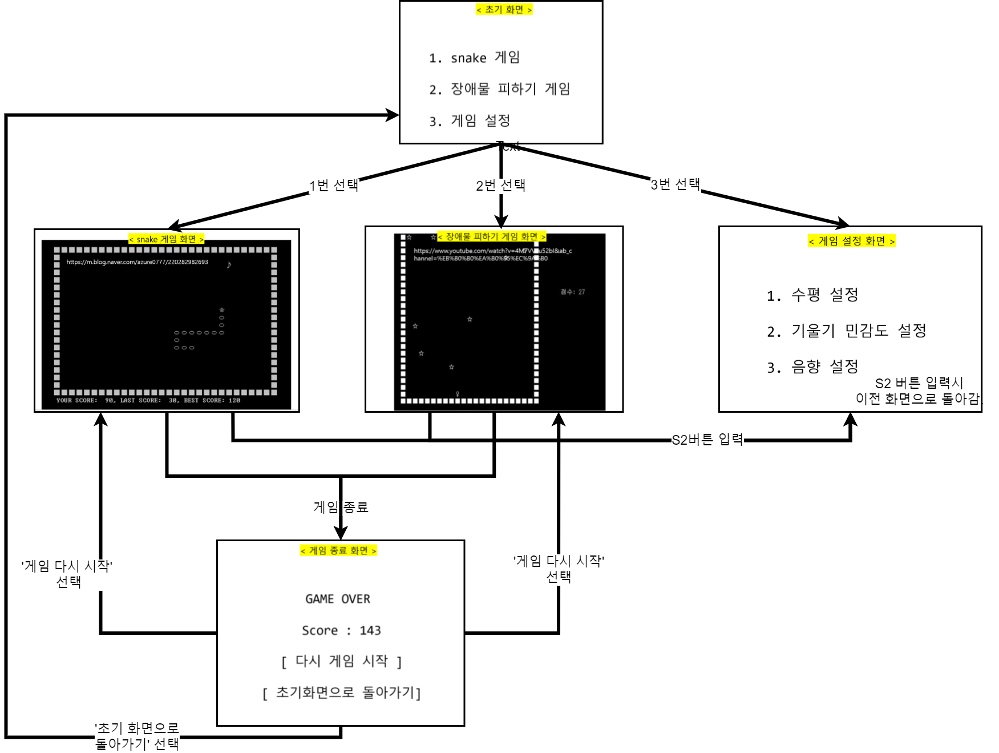

# Embedded_GameController
This project is done as a term project of embedded lecture. \
We implemented retro games (obstacle avoiding game, snake game) on linux and it's controller using stm32 board.

### some note
- Bluetooth communication is used to connect pc(linux) and controller(stm32).
- For implementing pc console game, we used Cpp language ncurses library.  
- In stm32 board, sensor inputs like button and joystick movement are handled by interrupt handler. 
- We added a sensitivity level setup page for players. Because required tilt sensitivity is different by each game. 

### snake game demo

### avoiding obstacle game demo

# Directory Structure 
* `GameController/` : 
   code for stm32 board, don't upload IAR settings/* Debug/* *.ewp ... etc which can cause IAR version conflict problems. 
   just download codes from this repo and create your local projects and do your works on it. 
   (tested on stm32f107) 
* `GamePC/` : 
  code that works on your pc (linux, tested on ubuntu20.04). 
* `GamePC/ObstaclesGame/` : code for avoiding obstacles game 
* `GamePC/SnakeGame/` : code for snake game 

# Sensor List
* Gyro Sensor [STS90H1-2A] (https://www.devicemart.co.kr/goods/view?no=1330838) 
* Arcade Game Machine Switch [SZH-ZR003] (https://www.devicemart.co.kr/goods/view?no=1376727)
* Joystick [SZH-JA038] (https://www.devicemart.co.kr/goods/view?no=13152304 )
* Bluetooth module [FB755AC]
